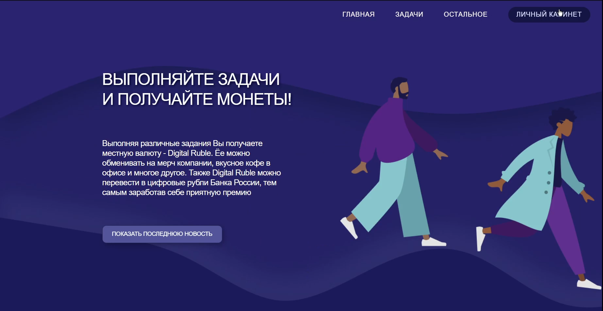
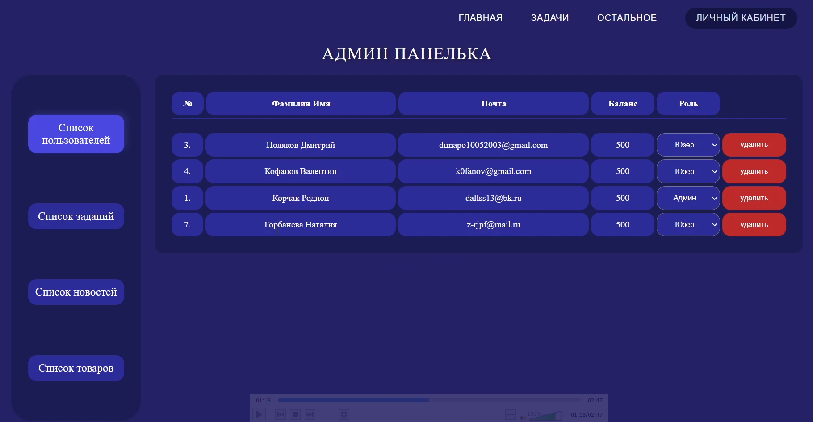
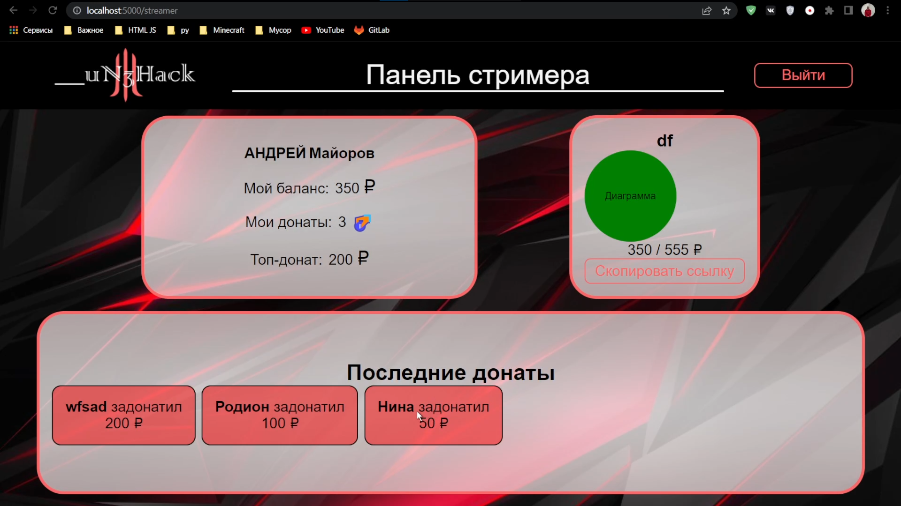
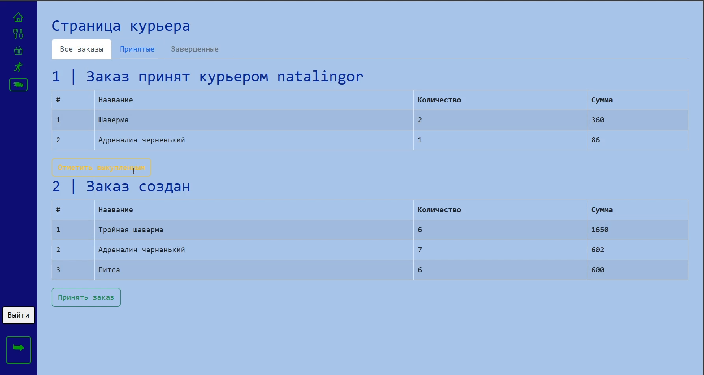

  

  <h1 margin="0">Корчак Родион</h1>

  
  

### Junior+ Frontend-developer
- [ ] React
- [ ] TypeScript
- [ ] Redux Toolkit
- [ ] Storybook
- [ ] Loki | Jest

[//]: # ()
[//]: # (
)

[//]: # (    
)

[//]: # (        )

[//]: # (        
Хакатон от ВТБ: More.HACK 4.0
)

[//]: # (    
)

[//]: # (    
)

[//]: # (            )

[//]: # (            
Хакатон от ВТБ: More.HACK 4.0
)

[//]: # (    
)

[//]: # (    
)

[//]: # (            )

[//]: # (            
Хакатон от ВТБ: More.HACK 4.0
)

[//]: # (    
)

[//]: # (    
)

[//]: # (            )

[//]: # (            
Хакатон от ВТБ: More.HACK 4.0
)

[//]: # (    
)

[//]: # (
)

  
